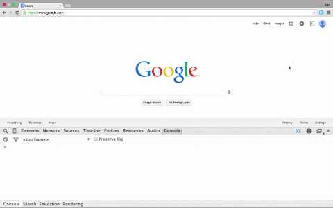

# Element-Identifier

Web browser extension for identifying elements on an web page.

Designed to be extended for other functions, see `Extend`.

## Installation

Chrome: Go to `chrome://extensions/`, check `Developer mode`, choose `Load unpacked extension...` and select the extension directory at `Element-Identifier-master/Element-Identifier-Chrome`.

## Demo

## Extend

A common usage would be to perform functions after a new element is hovered on. In js/element-identifier.js, edit the contents of the function `elementMouseOverCallback(element)`. By default, the function console logs the css path of the element that is hovered.

## Browser Support

* Chrome

## License

Distributed under the MIT license.